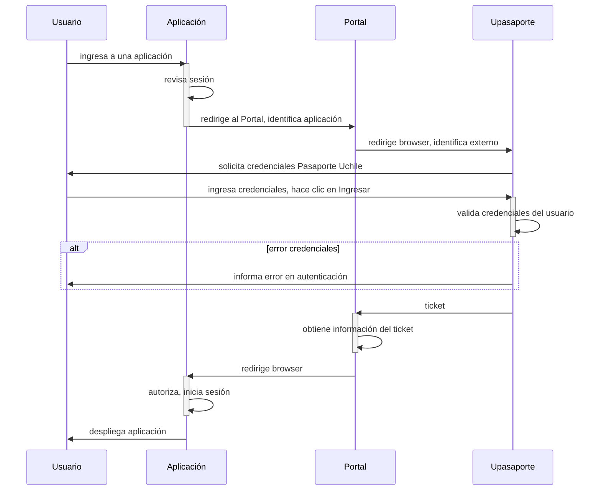

# Documentación

Este proyecto es un ejemplo de cómo integrar la autenticación del **`portal`** en un proyecto basado en Framework Django.

El flujo de autenticación para las aplicaciones que utilicen esta integración es el siguiente:

## Otros

- La documentación oficial del Portal: <https://github.com/DCC-FCFM-UCHILE/portal/tree/develop/doc>
- Diagramas de Secuencia: <https://mermaid-js.github.io/mermaid/#/sequenceDiagram>
- Actualmente GitHub no soporta el renderizado de mermaid, pero existe esta extensión: <https://github.com/BackMarket/github-mermaid-extension#install> (Chrome, Firefox, Opera)